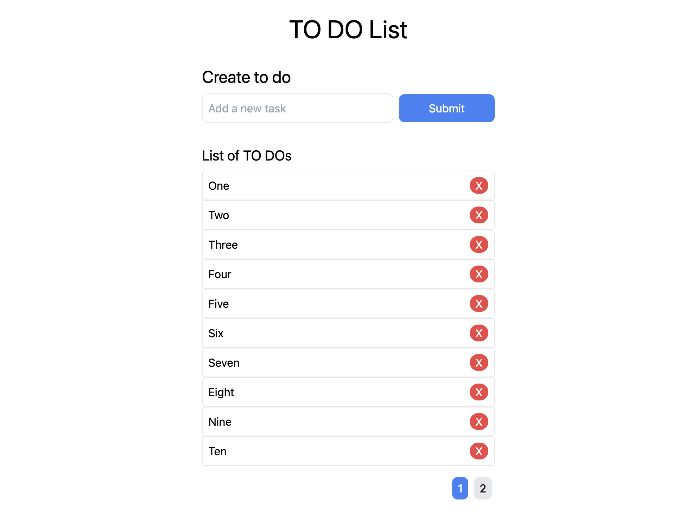

# React To Do List

This is a very simple todo list application written using React.js + vite

The `node_modules` have not been uploaded.

<h3>How to clone the repo</h3>

```

  create-react-app todolist

```

replace the public and src folders with those in this repo.

```
  npm start
```

## Web site display


